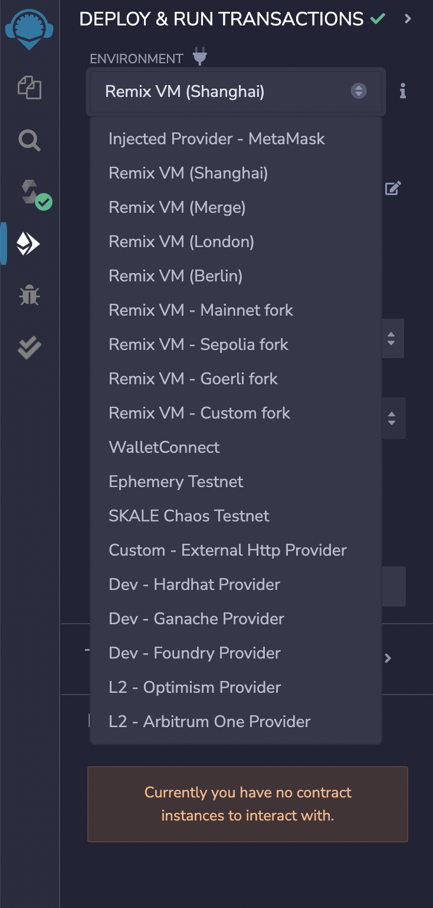
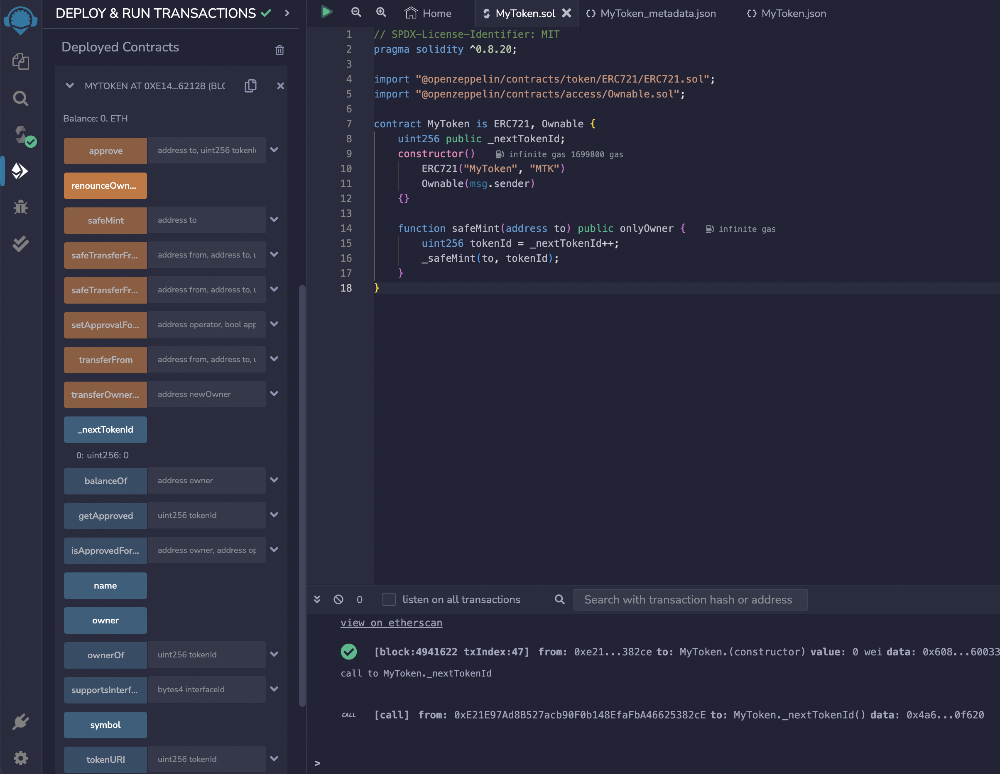
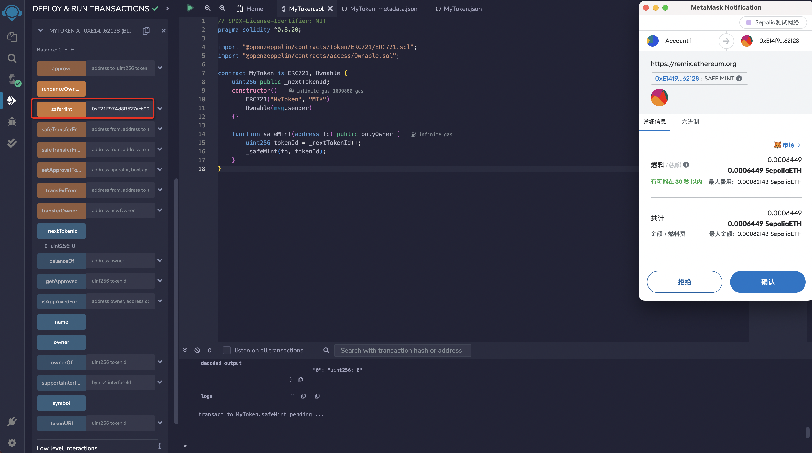

# 编译和部署合约

## 编译器

点击图标面板中的 `Solidity Compiler` 图标即可进入编译器界面。界面中默认展示编译器的基础配置项。点击`Advanced Configurations`按钮即可打开高级配置面板。在 `Advanced Configurations` 菜单中，您可以更改 EVM 版本、启用优化功能，并设置预计在合约生命周期内运行字节码的次数（默认设置为 200 次）。有关合约优化的更多信息，请参考 [Optimizer 上的 Solidity 文档](https://docs.soliditylang.org/en/latest/using-the-compiler.html#optimizer-options)。

在`File explorer` 中打开一个文件即可进行编译。如果打开了多个文件，请确保你想编译的文件在编辑器中处于选中状态。

有三种情况会触发编译：

- 使用快捷键 `control/command + s`
- 在`File explorer` 中右键单击文件并选择编译选项
- 点击`Compile`按钮

当编译完成时`Solidity Compiler` 图标旁会有一个绿色的完成标志，就像上边图片上的样子。并且`Remix`会为每个已编译合约创建三个 JSON 文件。这些文件可以在`File explorer`插件中看到：

1. `artifacts/<contractName>.json`: 包含`libraries`的链接、`bytecode`、部署后的`bytecode`、`gas estimation`、`identifiers`和 `ABI`。它用于将库地址与文件进行关联。
2. `artifacts/<contractName_metadata>.json`: 包含 `Solidity` 编译输出的元数据。
3. `artifacts/build-info/<dynamic_hash>.json`: 包含有关 `solc` 编译器版本、编译器输入和输出的信息。

就像下边图片里的一样：

> `ABI` 是一个描述合约接口的 JSON 数组。

点击`ABI`可以复制导出：

## 部署 & 运行

`Deploy&Run`是为了将交易发送到当前的`ENVIRONMENT`中。

### 环境

点击`ENVIRONMENT` 的下拉选择框，可以看到有许多的选项可供选择，`Remix VM (forkname)` 是不同的`Remix`的沙盒区块链。每次刷新旧的沙盒数据都会被清除。`forkname`是以太坊的分叉名；`Injected Provider - MetaMask` 是将`Remix`连接到一个注入的 web3 服务我本地的注入服务是 `Metamask`；`WalletConnect` 将 Remix 连接到移动设备上的钱包以及再往下的将`Remix`连接到远程`Provider`或者本地测试链。就像下边图里一样：

> 每一个 Remix VM 都带有 10 个账户，每个账户都有 100 个以太币。

> 在更真实的区块链环境中，您需要批准交易，然后等待交易被打包和确认。使用 Remix VM ，将立即执行。终端将提供有关交易的信息。新创建的实例显示在已部署合约部分。

### Deploy

在 `ENVIRONMENT` 下拉菜单处选择 `Injected Provider - MetaMask`。  
随后，`MetaMask` 将跳出弹窗并提示将其连接至 `Remix`。将`MetaMask` 连接至 `Remix` 后，侧面板将更新显示所连接的网络和账户。

现在，已完成钱包连接，可以开始部署合约。由于正在部署一个简单的 `ERC721` 智能合约，因此 `Remix` 设置的默认 `Gas Lmit` 为 300 万就足够了，无需指定随部署一同发送的值。为此，您可以执行以下步骤部署合约：

- 确保 `ENVIRONMENT` 已设置为 `Injected Provider - MetaMask`
- 确保连接的账户是想要部署的账户
- 使用默认的 `GAS LIMIT：3000000`
- 无需调整设定的 `VALUE：0`
- 确保所选合约为 `MyToken.sol`
- 点击 `Deploy`
- 点击 `transact` 发送部署交易
- `MetaMask` 将跳出弹窗，点击确认部署合约

### 部署成功

交易部署后，您将在 `Remix` 终端或者[区块链浏览器](https://sepolia.etherscan.io/tx/0xabb43c7560af6ba70684406488a9c2e586ca2d83aab2e7787f8f8afebc35d77e)看到部署交易的详情。此外，合约将出现在侧面板的 `Deployed Contracts` 部分下方。它默认处于折叠状态，可以点击小箭头展开它。

打开后您就可以看到合约中的方法。每一个方法按钮可能会有不同的颜色。

- 合约中的定义的`常量`或者`纯函数`，会是蓝色按钮。点击这种按钮不会创建新的交易，不会导致状态改变。只是返回了一个存储在合约中的值，所以这种按钮不会消耗`gas` 费用
- 那些会更改合约状态且不接受`ETH` 的方法称为`non-payable` 方法，这种方法会是一个橙色按钮。点击它们会创建一个交易，因此会产生`gas` 费用
- 还有一种我们本次没有用到的，红色按钮的方法。它是`Solidity` 中的`payable` 方法，点击会创建一个新交易，并且这个交易可以接收一个`value`的`ETH`

就像这样：

上图中，我们先点击了一次蓝色按钮 `_nextTokenId`，可以看到获取到的值为`0`，显示在按钮的下方。

那么我们继续在橙色按钮`safeMint`后的输入框里，输入我们合约方法里要求传入的类型为`address`的`to`参数，然后点击它。可以调起`MetaMask`的签署交易弹窗。点击`确认`，等待交易完成。

可以在终端里或者[区块链浏览器](https://sepolia.etherscan.io/tx/0xe2bfb8278e9b5dc486a6c136826ee59ceb4a20e3055db41a57d9e70c7746eee7) 看到我们发起的这一次交易`safeMint` 的详细信息。

那再次点击蓝色按钮 `_nextTokenId`，前边讲到过我们合约里写的每次`safeMint`，我们的`_nextTokenId` 都会自增一次。

下图中可以看到，我们已经获取到了`_nextTokenId` 从刚才的`0`变为了`1`.

合约里的其他函数都是一样的使用方法，`Remix`把通过自动生成的`UI` 与合约进行交互称它为 `udapp`。

到这里，我们的合约开发和部署就已经完成啦，你学会了吗？
