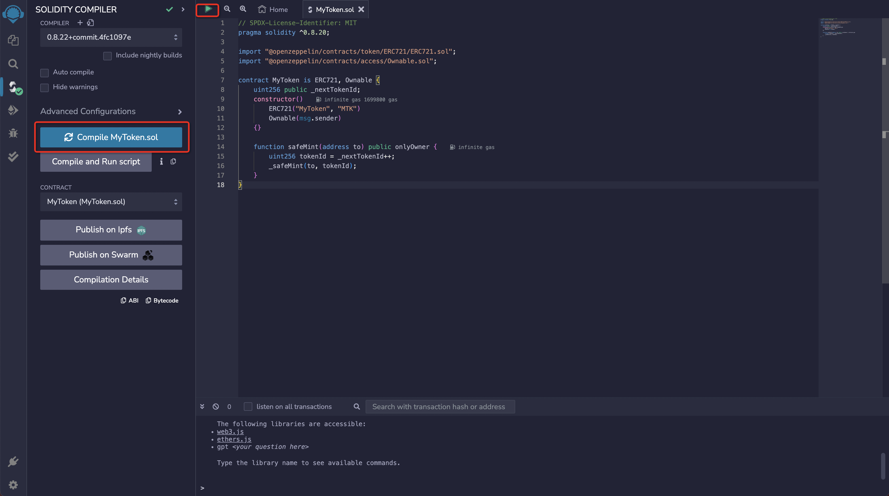
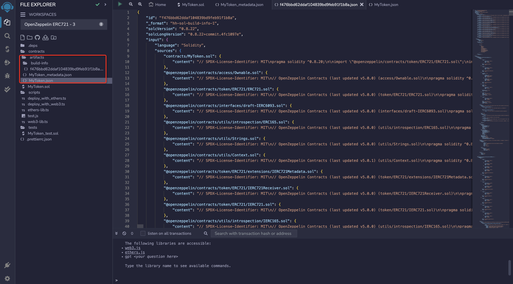
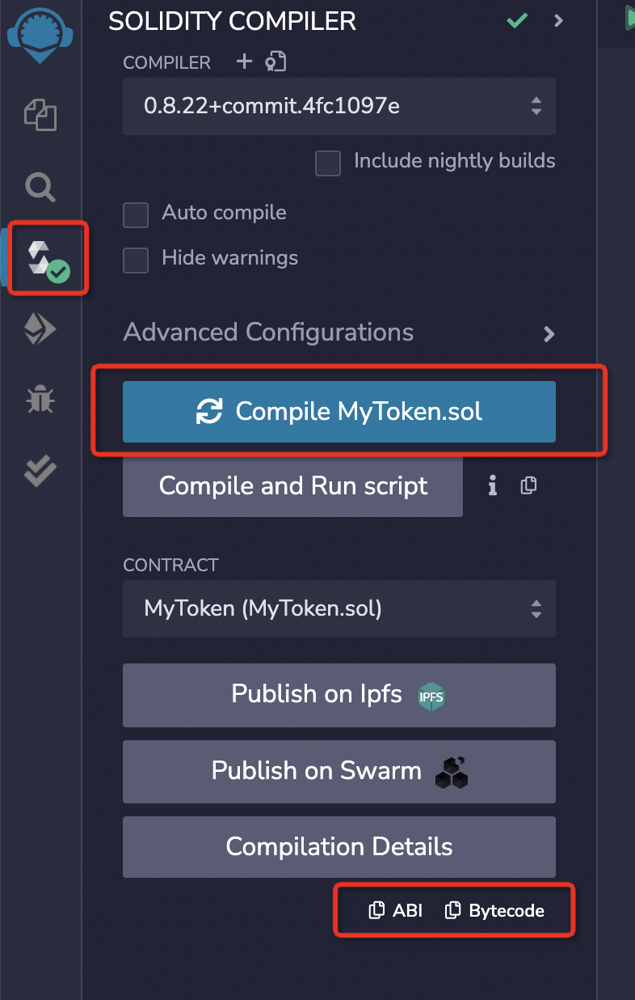
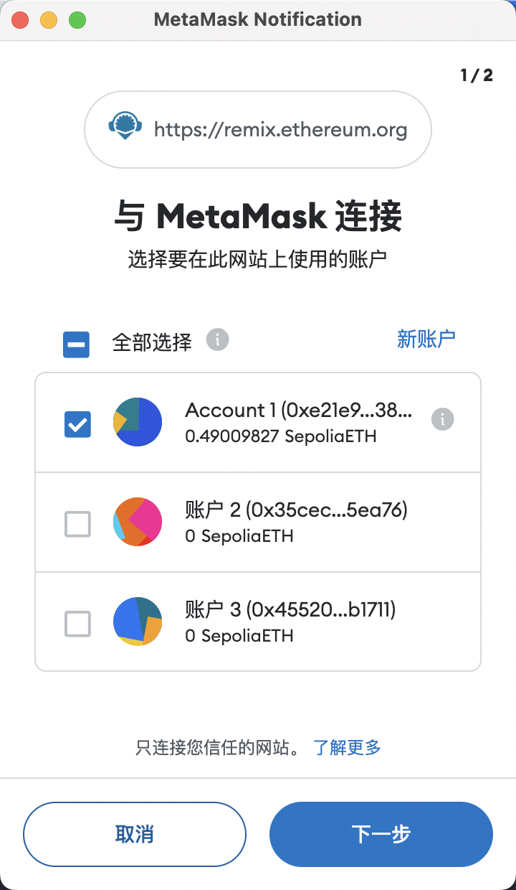
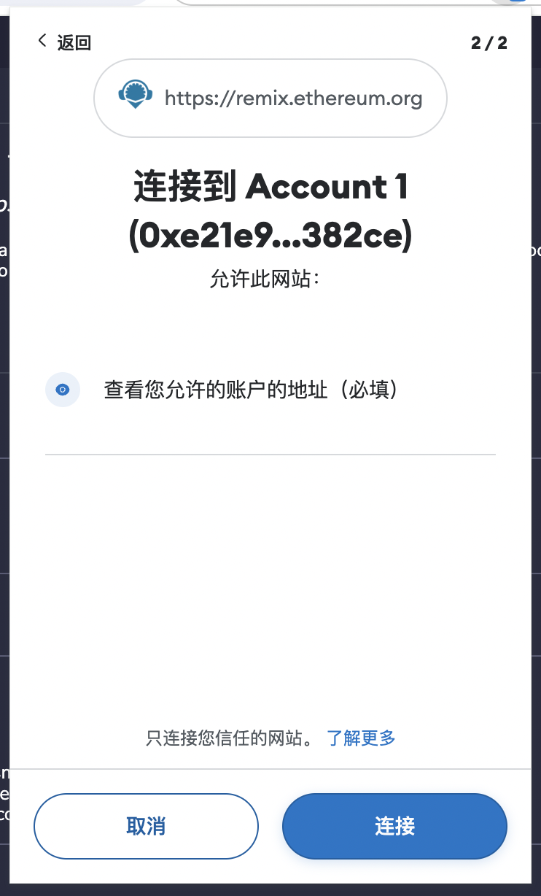
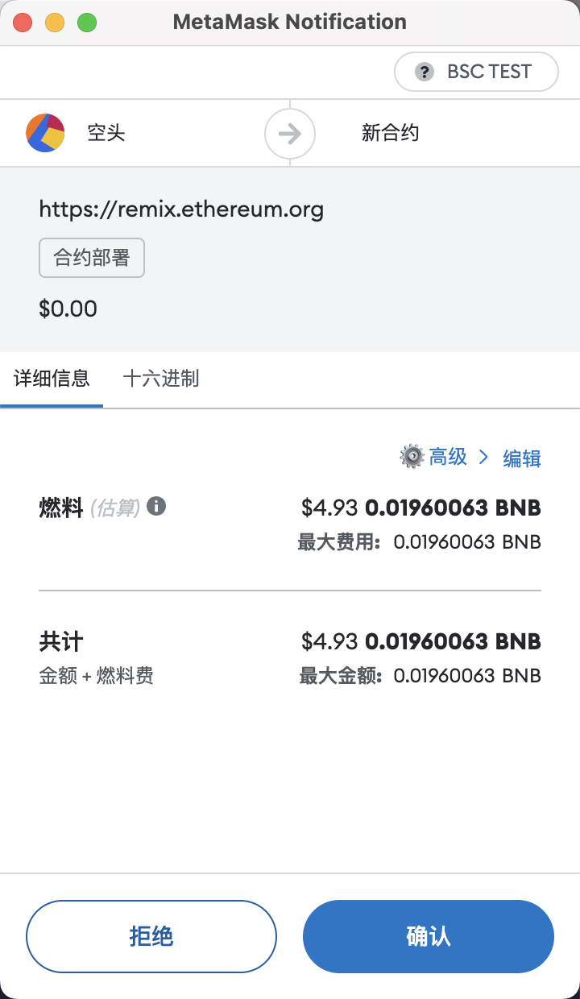
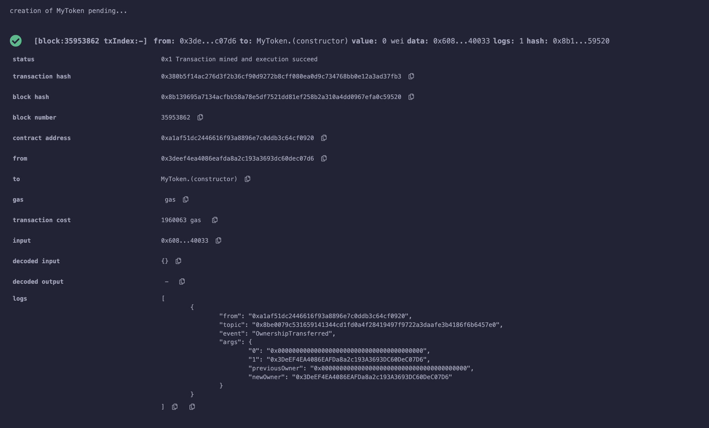
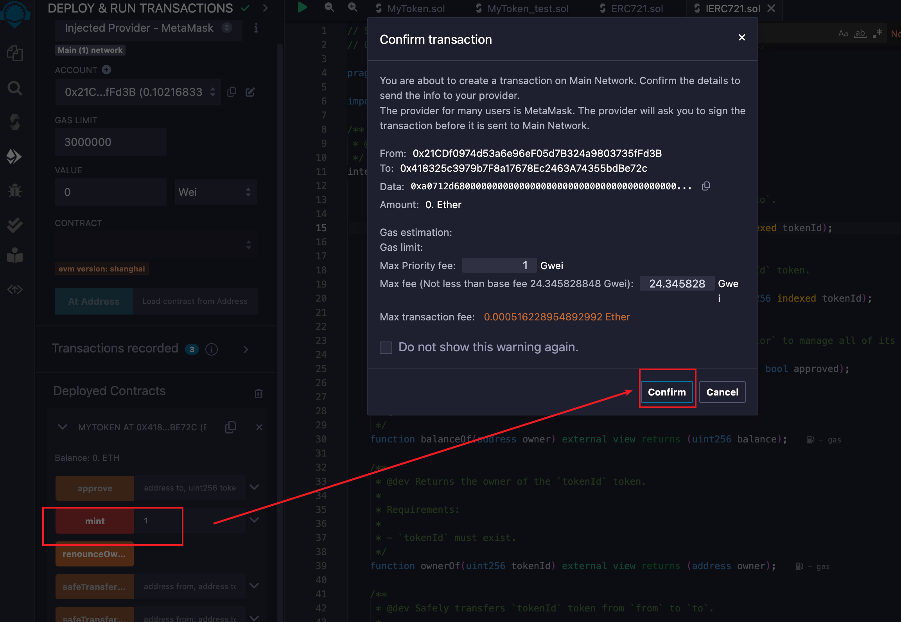

# 编译和部署合约

## 编译

点击图标面板中的 `Solidity Compiler` 图标即可进入编译器界面。界面中默认展示编译器的基础配置项。点击`Advanced Configurations`按钮即可打开高级配置面板。在 `Advanced Configurations` 菜单中，您可以更改 EVM 版本、启用优化功能，并设置预计在合约生命周期内运行字节码的次数（默认设置为 200 次）。有关合约优化的更多信息，请参考 [Optimizer 上的 Solidity 文档](https://docs.soliditylang.org/en/latest/using-the-compiler.html#optimizer-options)。

在`File explorer` 中打开一个文件即可进行编译。如果打开了多个文件，请确保你想编译的文件在编辑器中处于选中状态。

有三种情况会触发编译：

- 使用快捷键 `control/command + s`
- 在`File explorer` 中右键单击文件并选择编译选项
- 点击`Compile`按钮

当编译完成时`Solidity Compiler` 图标旁会有一个绿色的完成标志，就像上边图片上的样子。并且`Remix`会为每个已编译合约创建三个 JSON 文件。这些文件可以在`File explorer`插件中看到：

1. `artifacts/<contractName>.json`: 包含`libraries`的链接、`bytecode`、部署后的`bytecode`、`gas estimation`、`identifiers`和 `ABI`。它用于将库地址与文件进行关联。
2. `artifacts/<contractName_metadata>.json`: 包含 `Solidity` 编译输出的元数据。
3. `artifacts/build-info/<dynamic_hash>.json`: 包含有关 `solc` 编译器版本、编译器输入和输出的信息。

就像下边图片里的一样：

> `ABI` 是一个描述合约接口的 JSON 数组。

点击`ABI`可以复制导出：

## 部署

点击 `Deploy&Run` 可以将交易发送到当前的 `ENVIRONMENT` 中。部署合约需要消耗 GAS，即便是测试网也是如此。GAS 通过测试网的 ETH 支付，所以你还需要通过水龙头获取一些测试网的 ETH。比如你可以通过 [ZAN 的测试网水龙头](https://zan.top/faucet?chInfo=ch_antdweb3)获取 Sepolia 测试网的 ETH。

接下来我们尝试通过 MetaMask 部署合约到测试网 Sepolia 中，请先将你的 MetaMask 切换到测试网 Sepolia（当然你也可以切换到其它你习惯使用的测试网）。

点击`ENVIRONMENT` 的下拉选择框，可以看到有许多的选项可供选择，我们选择 `Injected Provider - MetaMask`。

随后，`MetaMask` 将跳出弹窗并提示将其连接至 `Remix`。将`MetaMask` 连接至 `Remix` 后，侧面板将更新显示所连接的网络和账户。部署到测试网也需要测试网的代币，你可以在网络上查找对应的测试网代币水龙头充值使用。

现在，已完成钱包连接，可以开始部署合约。由于正在部署一个简单的 `ERC721` 智能合约，因此 `Remix` 设置的默认 `Gas Limit` 为 300 万就足够了，无需指定随部署一同发送的值。为此，您可以执行以下步骤部署合约：

- 确保 `ENVIRONMENT` 已设置为 `Injected Provider - MetaMask`
- 确保连接的账户是想要部署的账户
- 使用默认的 `GAS LIMIT：3000000`
- 无需调整设定的 `VALUE：0`
- 确保所选合约为 `MyToken.sol`
- 点击 `Deploy`
- 点击 `transact` 发送部署交易
- `MetaMask` 将跳出弹窗，点击确认部署合约

交易部署后，您将在 `Remix` 终端看到部署交易的详情。此外，合约将出现在侧面板的 `Deployed Contracts` 部分下方。它默认处于折叠状态，可以点击小箭头展开它。

你可以尝试展开后再调用 `mint`，如下图所示：

这里的调用也会唤起 MetaMask 的交易确认弹窗，点击确认后，就可以发起交易了，这与 DApp 发起交易的流程一样。

至此，我们成功在测试网部署了一个合约。接下来我们会在下一节尝试在上一章开发的 DApp 中调用这个合约。
