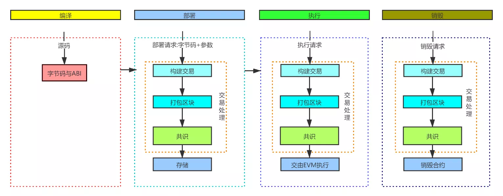

# 编译和部署合约

### 合约部署上链

1. 点击编译导出我们的 ABI

与其他语言一样，Solidity 的代码生命周期离不开编译、部署、执行、销毁这四个阶段。下图整理展现了 Solidity 程序的完整生命周期：  
  
经编译后，Solidity 文件会生成字节码。这是一种类似 jvm 字节码的代码。部署时，字节码与构造参数会被构建成交易，这笔交易会被打包到区块中，经由网络共识过程，最后在各区块链节点上构建合约，并将合约地址返还用户。当用户准备调用该合约上的函数时，调用请求同样也会经历交易、区块、共识的过程，最终在各节点上由 EVM 虚拟机来执行。

2. 选择 MetaMask 完成授权

在 ENVIRONMENT 下拉菜单处选择 Injected Provider - MetaMask。  
随后，MetaMask 将跳出弹窗并提示将其连接至 Remix。将 MetaMask 连接至 Remix 后，侧面板将更新显示所连接的网络和账户。

3. 部署合约

现在，已完成钱包连接，可以开始部署合约。由于正在部署一个简单的 ERC721 智能合约，因此 Remix 设置的默认 Gas 限制为 300 万就足够了，无需指定随部署一同发送的值。为此，您可以执行以下步骤部署合约：

- 确保 ENVIRONMENT 已设置为 Injected Provider - MetaMask
- 确保连接的账户是想要部署的账户
- 使用默认的 GAS LIMIT：3000000
- 无需调整设定的 VALUE：0
- 确保所选合约为 MyToken.sol
- 点击 Deploy
- 点击 transact 发送部署交易
- MetaMask 将跳出弹窗，点击确认部署合约

4. 部署成功

交易部署后，您将在 Remix 终端看到部署交易的详情。此外，合约将出现在侧面板的 Deployed Contracts 部分下方。

用我们部署成功的合约地址：[0xa1af51Dc2446616f93A8896E7C0DDb3c64cf0920](https://testnet.bscscan.com/address/0xa1af51Dc2446616f93A8896E7C0DDb3c64cf0920) 和 ABI 就可以去构建 Dapp 啦
