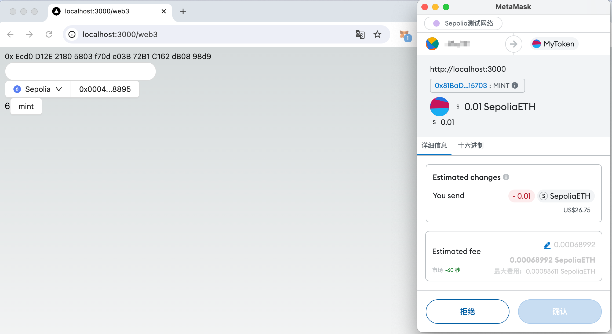

# Contract and DApp Integration

In this section, we will integrate the DApp developed in Chapter 2 with the contract deployed in this chapter to complete a complete DApp development task.

## Integrate DApp

In the DApp developed in the previous chapter, there is already a page that can call the contract. We only need to fill in the address of this contract in the DApp to call this contract.

In addition to the address, we also need to switch to the testnet. The specific code is as follows:

```diff
import { http, useReadContract, useWriteContract } from "wagmi";
import {
  WagmiWeb3ConfigProvider,
  MetaMask,
+  Mainnet,
+  Sepolia,
} from "@ant-design/web3-wagmi";
import {
  Address,
  NFTCard,
  Connector,
  ConnectButton,
  useAccount,
} from "@ant-design/web3";
import { injected } from "wagmi/connectors";
import { Button, message } from "antd";
import { parseEther } from "viem";

- const CONTRACT_ADDRESS = "0xEcd0D12E21805803f70de03B72B1C162dB0898d9";
+ const CONTRACT_ADDRESS = "0x81BaD6F768947D7741c83d9EB9007e1569115703"; // use your own contract address

const CallTest = () => {
  const { account } = useAccount();
  const result = useReadContract({
    abi: [
      {
        type: "function",
        name: "balanceOf",
        stateMutability: "view",
        inputs: [{ name: "account", type: "address" }],
        outputs: [{ type: "uint256" }],
      },
    ],
    address: CONTRACT_ADDRESS,
    functionName: "balanceOf",
    args: [account?.address as `0x${string}`],
  });
  const { data: hash, writeContract } = useWriteContract();
  const { isLoading: isConfirming, isSuccess: isConfirmed } =
    useWaitForTransactionReceipt({
      hash,
    });

  useEffect(() => {
    if (isConfirmed) {
      message.success("Mint Success");
      result.refetch();
    }
  }, [isConfirmed]);

  return (
    <div>
      {result.data?.toString()}
      <Button
        loading={isConfirming}
        onClick={() => {
          writeContract(
            {
              abi: [
                {
                  type: "function",
                  name: "mint",
                  stateMutability: "payable",
                  inputs: [
                    {
                      internalType: "uint256",
                      name: "quantity",
                      type: "uint256",
                    },
                  ],
                  outputs: [],
                },
              ],
              address: CONTRACT_ADDRESS,
              functionName: "mint",
              args: [BigInt(1)],
              value: parseEther("0.01"),
            },
            {
              onError: (err) => {
                message.error(err.message);
              },
            }
          );
        }}
      >
        mint
      </Button>
    </div>
  );
};

export default function Web3() {
  return (
    <WagmiWeb3ConfigProvider
       eip6963={{
         autoAddInjectedWallets: true,
       }}
+      chains={[Mainnet, Sepolia]}
       transports={{
         [Mainnet.id]: http(),
+        [Sepolia.id]: http(),
      }}
      wallets={[MetaMask()]}
    >
      <Address format address="0xEcd0D12E21805803f70de03B72B1C162dB0898d9" />
      <NFTCard
        address="0xEcd0D12E21805803f70de03B72B1C162dB0898d9"
        tokenId={641}
      />
      <Connector>
        <ConnectButton />
      </Connector>
      <CallTest />
    </WagmiWeb3ConfigProvider>
  );
};

```

Switch to the Sepolia testnet in the DApp page, and if you click the `mint` button, the MetaMask transaction confirmation pop-up window will be triggered if everything goes well:



After the transaction is online, and you will find that the previous `balanceOf` result has become `1`, which means that you have successfully minted an NFT. Of course, a truly good DApp will add events to the smart contract, listen to contract events on the front end, and then automatically update the results. But we will not introduce the event part in this introductory course.

## Complete example

The following is the complete example of the course:

<code src="./demos/dapp.tsx"></code>

You can also refer to the GitHub project source code [https://github.com/ant-design/ant-design-web3-demo](https://github.com/ant-design/ant-design-web3-demo).

So far, we have completed all the content of this course, I hope you can learn something from it, thank you all! 🎉
