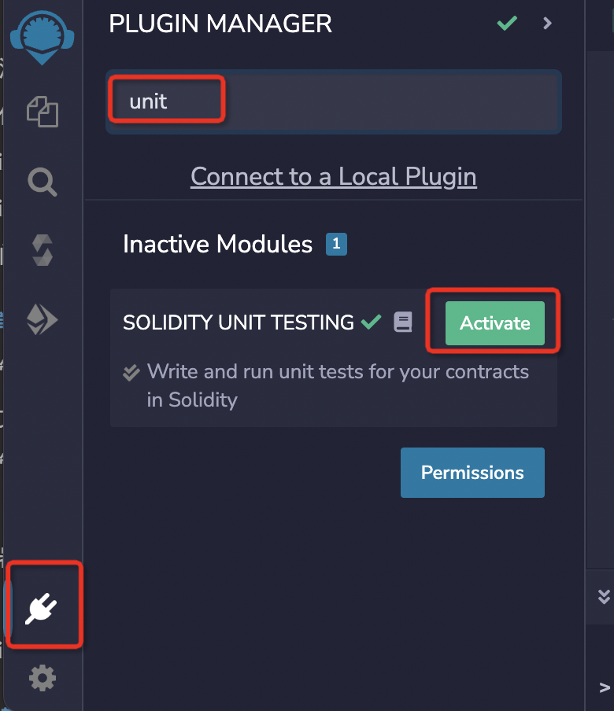
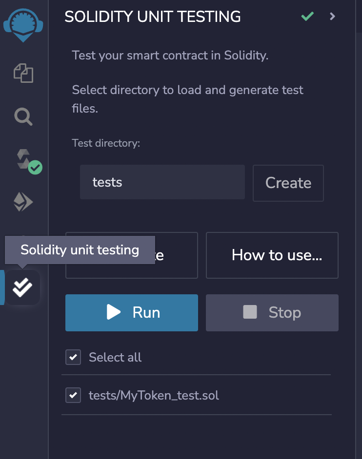
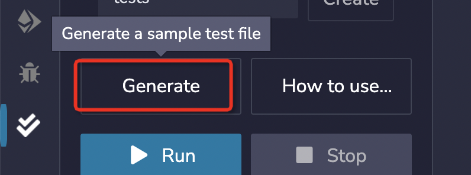
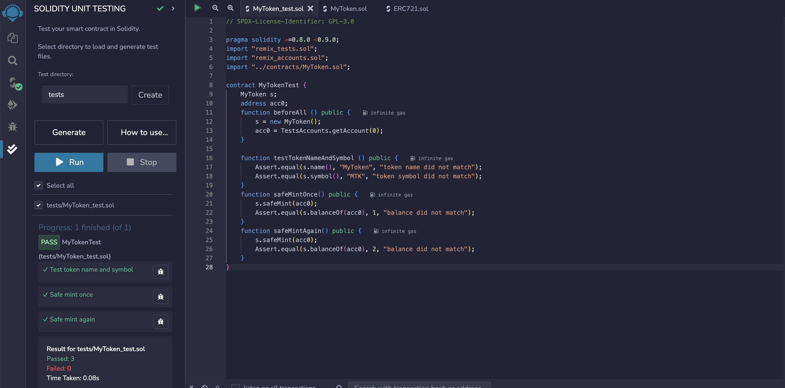
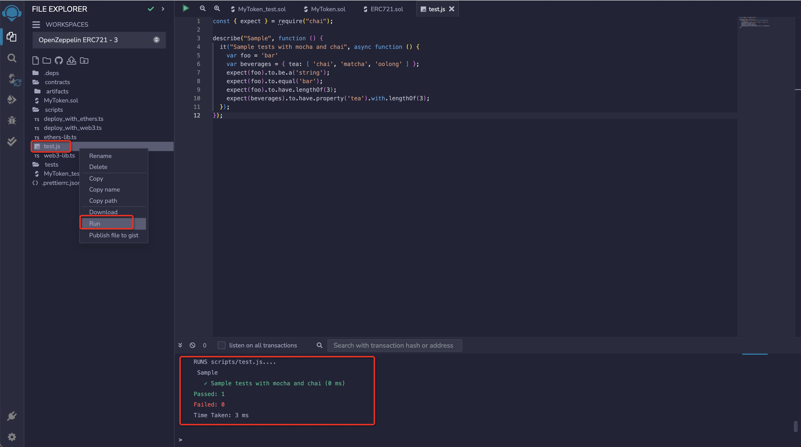

# Contract development and testing

## development contract

In the [previous article](./contract-init.md) we created a base contract for `ERC721` with `Mint` functionality, so let's move on to writing and compiling the contract.

In the following code we simply implement a new `mint` method to replace the `safeMint` generated by default. The new `mint` method maintains the same interface as the method we used in the previous chapter so that we can replace the course's contract with the new one once we have deployed the contract.

Specifically to be modified within there:

1. set `initialOwner` to be the contract issuer so that it is simpler to deploy the contract without having to specify `initialOwner`.
2. define a contract private variable `private` named `_nextTokenId` of type `uint256` to mark the current progress, and add one to the value for each new NFT. 1. set `mint` as the contract issuer so that it will be easier to deploy contracts without specifying `initialOwner`;
3. `quantity` of type `uint256` is required to be passed in `mint` method to represent how many NFTs are to be minted this time, here we simplify the logic by limiting the minting to one at a time.
4. remove the `onlyOwner` modifier so that anyone can call the `mint` method. 2. add the `payable` modifier so that anyone can call the `mint` method.
5. add the `payable` qualifier so that anyone calling the `mint` method can transfer money to the contract at the same time.
6. `_safeMint` should also be changed to `_mint`, mainly to avoid errors when testing the contract by calling it from a Remix contract later on, and `to` should be changed to `msg.sender`, which stands for the address that the NFT is casting to for initiating the transaction.

The code is as follows：

```diff
// SPDX-License-Identifier: MIT
pragma solidity ^0.8.20;

import "@openzeppelin/contracts/token/ERC721/ERC721.sol";
import "@openzeppelin/contracts/access/Ownable.sol";

contract MyToken is ERC721, Ownable {
+    uint256 private _nextTokenId = 0;

-    constructor(address initialOwner)
+    constructor()
        ERC721("MyToken", "MTK")
-        Ownable(initialOwner)
+        Ownable(msg.sender)
    {}

-    function safeMint(address to, uint256 tokenId) public onlyOwner {
+    function mint(uint256 quantity) public payable {
+        require(quantity == 1, "quantity must be 1");
+        require(msg.value == 0.01 ether, "must pay 0.01 ether");
+        uint256 tokenId = _nextTokenId++;
-        _safeMint(to, tokenId);
+        _mint(msg.sender, tokenId);
    }
}
```

> `Private` refers to methods and variables that can only be called in the pre-deployment contract, while `public` methods and variables are accessible to everyone.

## test contract

1. Unit Test Plugin

We need to click on the `Plugin Manager` icon in the bottom left corner of the plugin manager to search for the `unit` keyword, then the search result `SOLIDITY UNIT TESTING` will appear, click on `Activate` to install and activate the plugin, as shown in the figure below:



The `Solidity unit testing` icon will then appear in the left icon bar and clicking on it will load the plugin in the side panel.

After successful loading, the plugin should look like this:



2. Unit test documentation

Remix injects a built-in assert library that can be used for testing. You can see the documentation of the library [here](https://remix-ide.readthedocs.io/en/latest/assert_library.html).  
In addition to this, Remix allows some special functions to be used in the test file to make the tests more structured. They are:

- `beforeEach()` - Run before each test
- `beforeAll()` - Run before all tests
- `afterEach()` - Run after each test
- `afterAll()` - Run after all the tests

Our unit test file, in the directory `tests/MyToken_test.sol`, is there because the template contract we chose automatically created the test contract for us. If we had created a new blank folder, then we would need to click through the `Generate` button to generate the test file, as shown below:



Then we click on our test file `tests/MyToken_test.sol` in `File explorer` and write the following test:

1. `remix_tests.sol` is automatically injected by `Remix`;
2. `remix_accounts.sol` generates the list of test account addresses for us;
3. `../contracts/MyToken.sol` introduces the contract file we have written;
4. instantiated our contract `MyToken` defined as `s` in `beforeAll()` and took a test address and saved it `TestsAccounts.getAccount(0)` defined as `acc0`;
5. verify in `testTokenNameAndSymbol()` that the instantiated contract `name()` is going to get the value `MyToken` and `symbol()` the value of `MTK`;
6. Write a function `testMint()` that calls our `mint(1)` method, and the value of `balanceOf()` cast once should be `1`. The code for the `tests/MyToken_test.sol` is as follows：

```solidity
// SPDX-License-Identifier: GPL-3.0

pragma solidity >=0.8.0 <0.9.0;
import "remix_tests.sol";
import "remix_accounts.sol";
import "../contracts/MyToken.sol";

contract MyTokenTest {
    MyToken s;
    function beforeAll () public {
        s = new MyToken();
    }

    function testTokenNameAndSymbol () public {
        Assert.equal(s.name(), "MyToken", "token name did not match");
        Assert.equal(s.symbol(), "MTK", "token symbol did not match");
    }
    /// #value: 10000000000000000
    function testMint() public payable {
        s.mint{value: msg.value}(1);
        Assert.equal(s.balanceOf(address(this)), 1, "balance did not match");
    }
}
```

Remix's single test is to call the contract we want to test in a contract to test, the details will not be expanded first, you can refer to [Remix unit test plugin's documentation](https://remix-ide.readthedocs.io/en/latest/unittesting.html).

3. Running Unit Tests

When we have finished writing the test, select the file and click `Run` to execute the test. The execution will run in a separate environment. After completing the execution of a file, the following test summary will be displayed:



And that's it, unit testing for our contract is done.

Of course, if you're more comfortable testing with Chai and Mocha, `Remix` is also supported.

> Chai is a BDD / TDD assertion library for Node.js and browsers that pairs happily with any JavaScript testing framework.Mocha is a feature-rich JavaScript testing framework that runs on Node.js and browsers, making asynchronous testing easy and fun.

Simply create a `js` file in your workspace, preferably in the `scripts` folder. Then right click on the new `js` file with the test code written in it and click `Run`.  
It will look something like this:



Click `Run` and the results will be displayed in the terminal after executing the test.

Here is just an example, providing ways and means by which this can be done, and is fully supported if you are good at this approach.

Next we'll try, `Compile` and `Deploy Upstream` the contract file we wrote.
