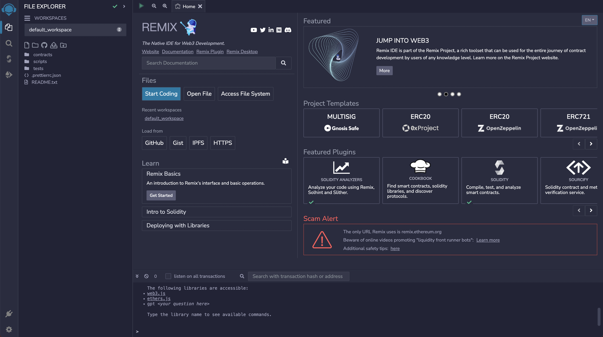
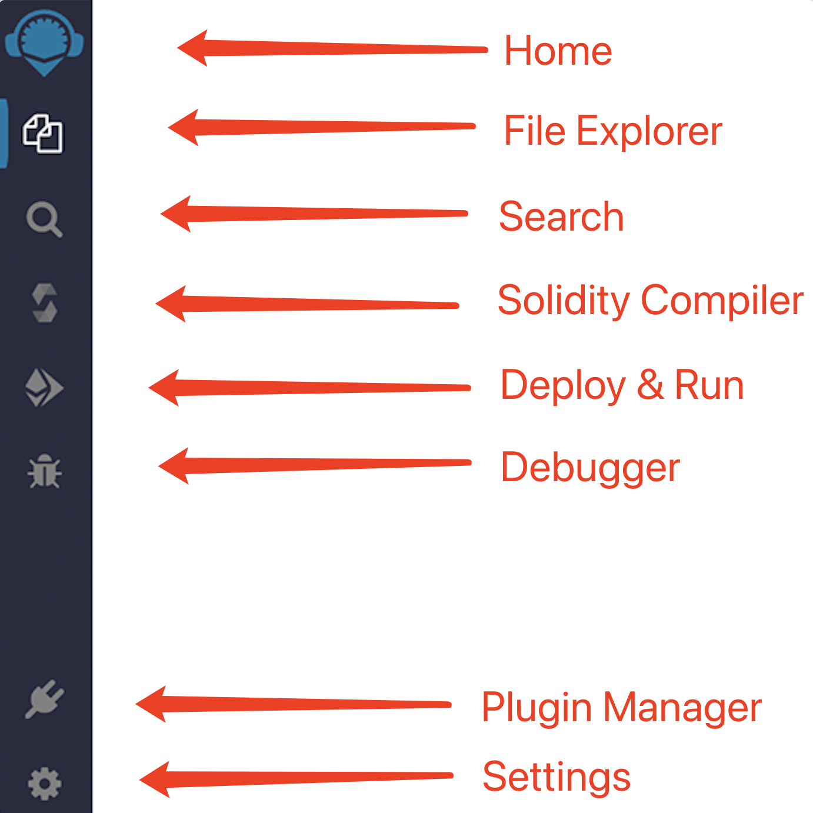
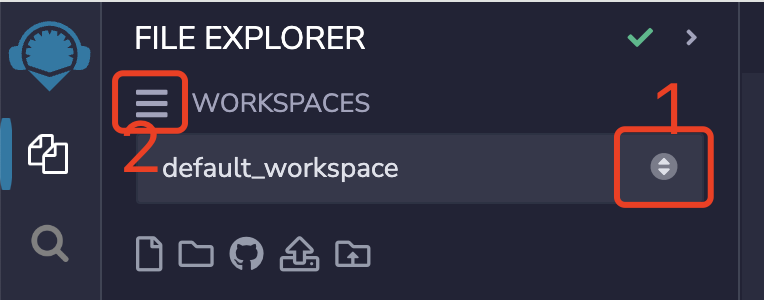
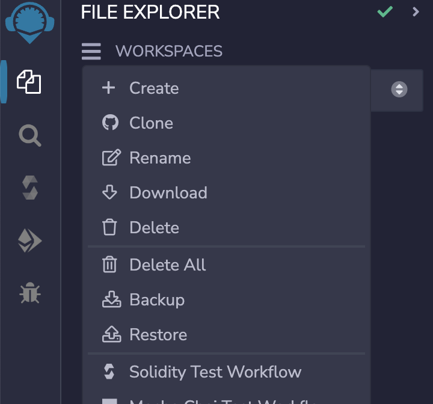
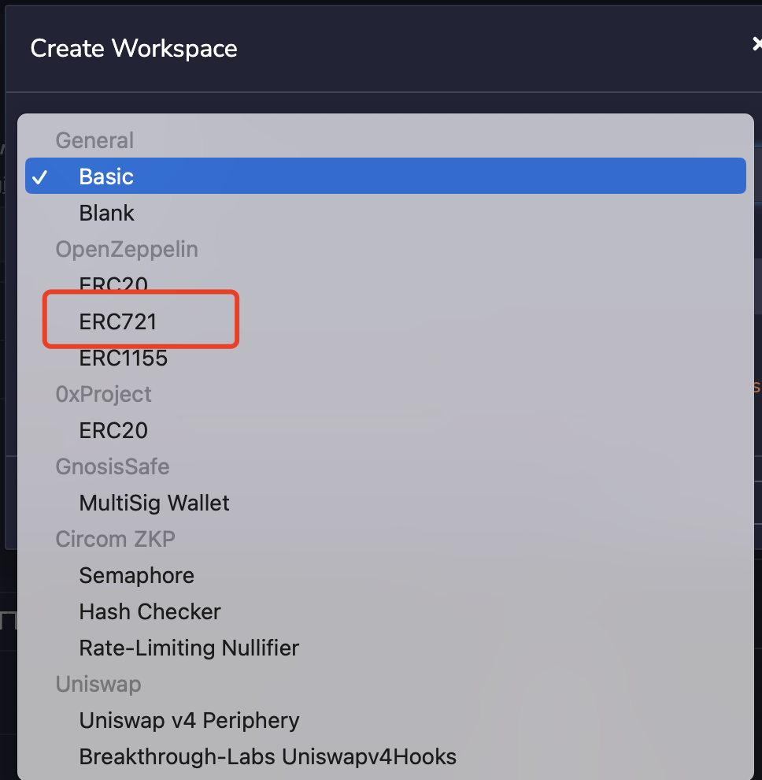
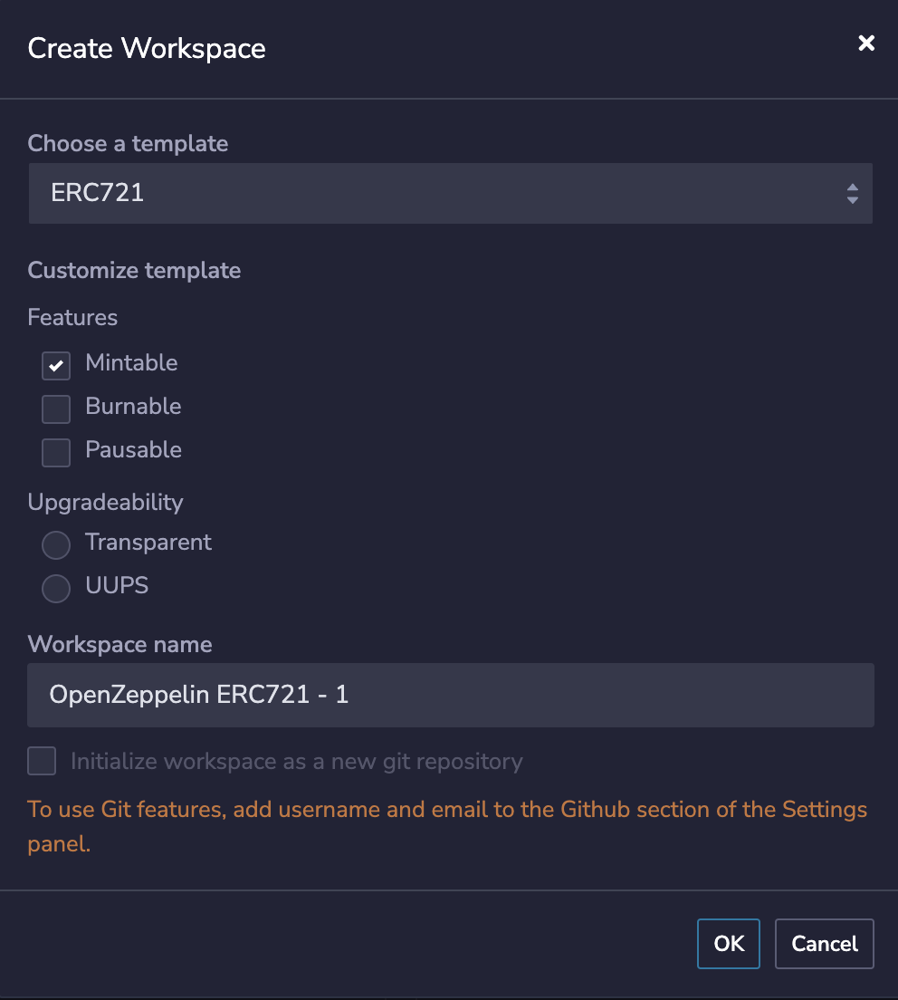
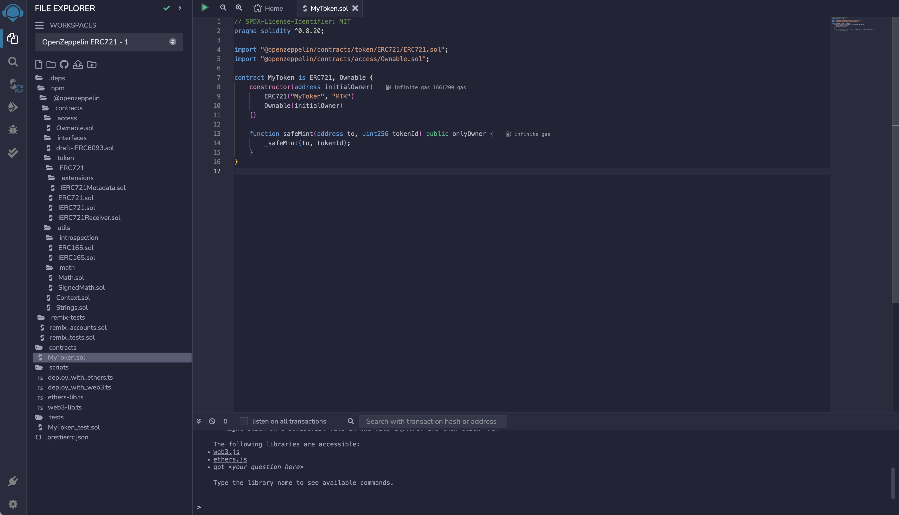

# Initialize contract

## Overview

In this course, we will use `Remix` to run the `Solidity` contract.

`Remix` is the official recommended integrated development environment (IDE) for smart contracts on Ethereum. It is suitable for novices. It provides an easy-to-use interface to quickly write, compile and deploy smart contracts in the browser without installing any programs locally.

`Solidity` is a high-level programming language created for implementing `smart contracts`. This language is influenced by the `C++`, `Python` and `JavaScript` languages, and is designed to run on the Ethereum virtual machine (`EVM`). `Solidity` is a statically typed language that supports inheritance, libraries, and complex user-defined types.

## Panel

Enter [Remix](https://remix.ethereum.org), we can see the interface as shown in the figure below:

As you can see, `Remix` consists of three panels and a terminal.

1. Icon panel-click to change the plug-in displayed in the side panel;
2. Side panel-most of the interfaces of the plug-in (not all plug-ins) are here;
3. Main panel-used to edit files, large-scale tools and home page tabs;
4. Terminal-for viewing transaction receipts and various logs.

### Icon panel

A brief introduction to the side panel icon function, we will have a more detailed introduction when we use it later. `Home` can always open the main page, even if it is turned off. `File explorer` is used to manage workspaces and files. `Search` is a global search function. `Solidity Compiler` is the interface of the contract compiler. The interface displays the basic configuration items of the compiler by default, and the `Advanced Configurations` button opens the advanced configuration panel. `Deploy&Run` is to send the transaction to the current `environment`. `Debugger` is a debugger. When debugging a transaction, the debugger will display the status of the contract. `Plugin Manager` is a plug-in manager, there are many plug-ins to choose from. `Setting` will have some basic settings, such as `language`, `theme`, `GitHub access token`, `general settings`, etc.

## Workspace and file

The `WORKSPACES` in `Remix` is a special folder that separates projects. The files in a workspace cannot import or access files in another workspace. As shown in the figure below, click icon 1 to switch different workspaces, and icon 2 can perform a series of operations on the workspace, such as `Create`, `Clone`, `Rename`, `Download`, `Delete`, etc.

 

## Create

We will demonstrate through the `Create` button in this tutorial. When we click `Create`, the `Create Workspace` pop-up window will pop up. `Remix` provides the following templates:

- Basic
- Blank
- OpenZeppelin ERC20
- OpenZeppelin ERC721
- OpenZeppelin ERC1155
- 0xProject ERC20
- Gnosis Safe

When you select an `ERC721` template of the `OpenZeppelin` library, you can add additional features.

> [ERC721](https://eips.ethereum.org/EIPS/eip-721) (Ethereum Request for Comments 721), proposed by William Entriken, Dieter Shirley, Jacob Evans, Nastasia Sachs in January 2018, is a non-homogeneous token standard that implements token APIs in smart contracts. [OpenZeppelin](https://docs.openzeppelin.com/contracts/5.x/) is a library for secure smart contract development, which contains the standard implementation of many commonly used contracts.

 

Check `Mintable`, which means that we add the `Mint` method to the template contract, and then click `OK`. Here, our `Workspace` is created. As shown in the figure below:

`.deps` directory contains the npm package of `@openzeppelin` we installed. The `contract template` referenced in our contract is installed here, as well as the `toolkit` referenced in the contract template. `contracts` is the contract file written by ourselves. `scripts` folder contains the automatically generated script files for deploying contracts. You can also deploy contracts by executing the js file below this. `tests` automatically writes some automatic verification test files.

`@openzeppelin` provides us with the `ERC721` contract template in `contracts/MyToken.sol`, let's take a brief look at the content of this contract.

1. The first line is a comment, which will write the software license (`license`) used by this code. Here we use `MIT license`. If no license is written, a warning (`warning`) will be issued during compilation, but the program can run. `solidity` comments start with `//`, followed by the content of the comment (will not be executed by the program).
2. The second line declares the `solidity` version used by the source file, because different versions have different syntax. This line of code means that the source file will not allow compilers less than version `0.8.20` or greater than or equal to `0.9.0` to compile (the second condition is provided by `^`). `Solidity` statements end with a semicolon (`;`).
3. The 4-5 lines import external `Solidity` files, and the imported `Solidity` files and the `Solidity` files themselves are equivalent to the same `Solidity` contract.
4. Line 7 creates a contract (`contract`) and declares the name of the contract as `MyToken`. The keyword `is` indicates that the contract inherits the imported `ERC721` and `Ownable` contracts.
5. Lines 8-10, within the `constructor`, we pass the predefined parameters of the inherited contracts. For `ERC721`, we pass the `name` and `symbol` of the `token`, and for `Ownable`, we pass the address of the contract owner.
6. Lines 13-15 define a `public` method called `safeMint`, which is accessible to the outside world. This method requires two parameters: `to`, of type `address`, and `tokenId`, of type `uint256`. Inside the method, the private method `_safeMint()` from the `ERC721.sol` contract is executed, along with the provided `to` and `tokenId` parameters.

Next, we will try to write some custom functions to the contract template.
