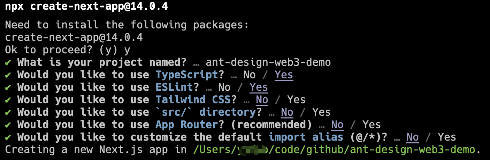
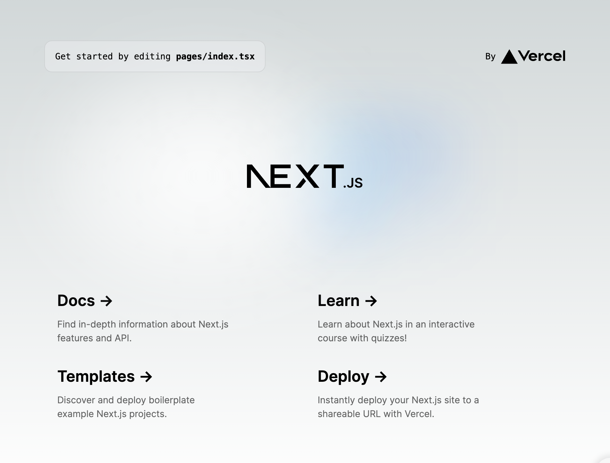
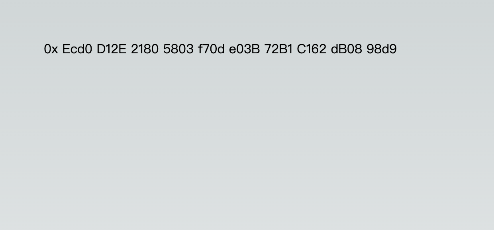

# 初始化项目

## 简述

这部分课程中，我们将指导你搭建一个 DApp 的前端部分。该 DApp 将会实现一个铸造 NFT 的功能，用户连接钱包后可以点击铸造一个 NFT 并查看铸造后的 NFT。

这部分暂时不会涉及到智能合约的开发，智能合约开发将会放到下一部分课程教学，我们会提供一个用于测试的智能合约来供该 DApp 调用。

本教程的完整代码你可以在 [https://github.com/ant-design/ant-design-web3-demo](https://github.com/ant-design/ant-design-web3-demo) 找到。

## 初始化一个 React 项目

我们将基于 [React](https://react.dev/) + [Next.js](https://nextjs.org/) + [TypeScript](https://www.typescriptlang.org/) 来初始化我们的项目。当然，如果你更熟悉 [umi](https://nextjs.org/) 等其它前端框架，也可以使用你熟悉的框架。你依然可以参考该教程，不过对于非专业的前端开发者，我们建议一步步按照我们的教程来完成，避免遇到一些框架差异导致的问题。

在开始之前，请先确保你安装了 [Node.js](https://nodejs.org/)，并且版本大于 20.0.0。教程会基于最新的 Node.js 版本来编写，如果你使用的是旧版本的 Node.js，可能也能运行，但是当你遇到问题时，可以尝试升级 Node.js 版本。

安装完成后你可以通过如下命令检查 Node.js 和它自带的 `npm` 于 `npx` 是否安装成功：

```bash
node -v # => v20.0.0+
npm -v # => 10.0.0+
npx -v # => 10.0.0+
```

接下来我们参考 [Next.js 官方文档](https://nextjs.org/docs/getting-started/installation)，来创建一个新项目：

```bash
npx create-next-app@14.0.4 # 我们指定 create-next-app 的版本为 14.0.4，避免升级带来的差异影响教程的细节
```

请按照提示创建一个新的项目，我们将其命名为 `ant-design-web3-demo`，具体的技术栈选择你可以参考下图：



我们去掉了 `Tailwind CSS` 和 `App Router` 的选择，让项目变得更简单，实际项目中你应该按照你的需求选择需要的内容。

## 安装依赖并启动项目

创建完成之后进入项目目录安装依赖：

```base
cd ant-design-web3-demo
npm i
```

安装完成后执行 `npm run dev` 启动项目，你可以在浏览器中访问 `http://localhost:3000` 来查看项目是否启动成功。



## 添加 Ant Design Web3

接下来，我们安装 Ant Design 和 Ant Design Web3 的基础组件到项目中：

```bash
npm i antd @ant-design/web3 --save
```

安装完成后，因为 Next.js 当前版本[已有的一个问题](https://github.com/ant-design/ant-design/issues/46053)，你需要在 `next.config.js` 中添加如下配置：

```diff
/** @type {import('next').NextConfig} */
const nextConfig = {
  reactStrictMode: true,
+ transpilePackages: [  "@ant-design", "antd", "rc-util", "rc-pagination", "rc-picker", "rc-input" ],
}

module.exports = nextConfig
```

安装完成后，新建 `pages/web3.tsx` 的文件，填充内容如下：

```tsx | pure
import { Address } from '@ant-design/web3';

export default function Web3() {
  return <Address format address="0xEcd0D12E21805803f70de03B72B1C162dB0898d9" />;
}
```

然后访问 [http://localhost:3000/web3](http://localhost:3000/web3) 可以看到你已经在项目中成功使用 Ant Design Web3 了 🎉



为了让页面更美观，避免上图中的横条样式，你可以在项目中的 `styles/global.css` 的第八十多行添加如下内容：

```diff
html,
body {
  max-width: 100vw;
+  min-height: 100vh;
  overflow-x: hidden;
}
```

当然，这并不是必须的。
