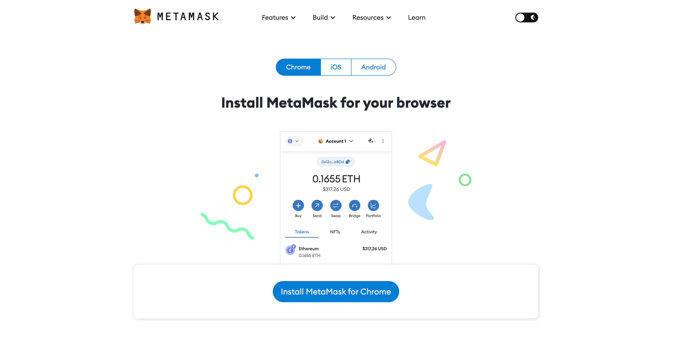
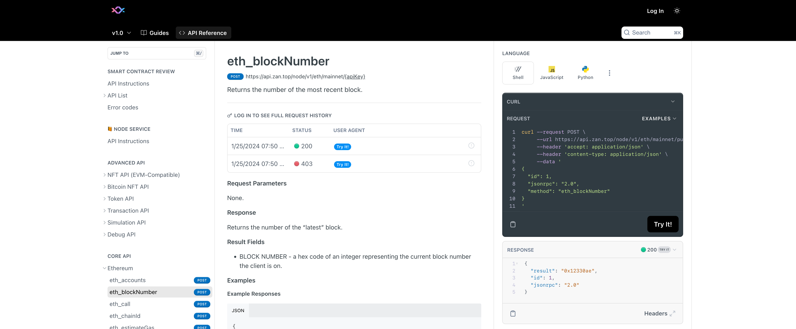

# How DApp calls smart contracts

We take Ethereum as an example. After the smart contract is deployed to the blockchain, we can call the corresponding method in the contract by constructing the Ethereum transaction (Transaction), provided that we know the ABI file of the contract and the HASH address of the contract.

<!-- prettier-ignore -->
:::info
ABI is the abbreviation of Application Binary Interface, which is a binary interface standard for defining the functions and parameters of smart contracts. The contract HASH is the address of the contract on the blockchain. They can be obtained when deploying smart contracts.
:::

There are generally two ways for DApp to call contract methods: connect through wallet plug-ins and connect directly through node RPC. We mainly introduce the first method.

## Through MetaMask wallet

[MetaMask](https://metamask.io/) is currently the most popular wallet plug-in in the Ethereum ecosystem. It provides a simple way for users to manage their Ethereum assets in the browser, and it is also a bridge for DApp to interact with the Ethereum network. If you haven't used it yet, you can download and install it [here](https://metamask.io/download/), and refer to the official website tutorial to complete the initial configuration.



After the MetaMask wallet is installed, we can see the MetaMask icon in the upper right corner of the browser, and it will also inject the `window.ethereum` object into each page. This object is the interface for DApp to interact with the Ethereum network. We can use it to call Ethereum API. For example, we can initiate an `eth_chainId` RPC request to get the ID of the current network:

```js
await window.ethereum.request({ method: 'eth_chainId' }); // 0x1 represents the Ethereum mainnet
```

We can also get the account address and other information of the current wallet through the following code:

```js
async function getAccount() {
  const accounts = await window.ethereum.request({ method: 'eth_requestAccounts' }).catch((err) => {
    if (err.code === 4001) {
      // EIP-1193 userRejectedRequest error
      // If this happens, the user rejected the connection request.
      console.log('Please connect to MetaMask.');
    } else {
      console.error(err);
    }
  });
  const account = accounts[0];
  return account;
}

await getAccount(); // your account address
```

More wallet RPC and API can refer to [MetaMask official documentation](https://docs.metamask.io/guide/rpc-api.html#other-rpc-methods).

<!-- prettier-ignore -->
:::info
It is complex and error-prone to access the wallet directly with js. We recommend using [Ant Design Web3](./dev-init.md) in the project to make DApp development more convenient.
:::

## Through node RPC

Through the previous study, we learned that the blockchain is a decentralized network, and we can access data by accessing one of the nodes. There are many nodes in the Ethereum network. We can use [ZAN](https://zan.top/?chInfo=ch_antdweb3), [Infura](https://infura.io/) and other node service providers to obtain RPC interfaces.

In the [document](https://docs.zan.top/reference/eth-accounts) provided by ZAN.top, we can easily test RPC, and call the method of smart contract through RPC.



## Summarize

In this section, we learned how DApp calls smart contracts. We can use wallet plug-ins or node RPC to call smart contracts. In the next section, we will learn how to use Ant Design Web3 to call smart contracts.
