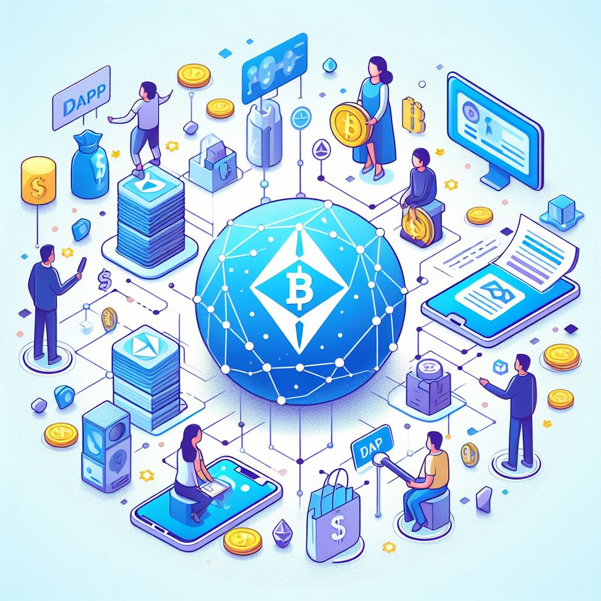

# DApp 介绍

## 🤔 什么是 DApp？

去中心化应用程序 (Decentralised Application, 简称为 `DApp`) 是在去中心化网络上构建的应用程序，主要由「智能合约」和「前端用户界面」构成。

  

## 🌟 DApp 特性

- **去中心化**：DApp 在去中心化、开放的网络上运行，没有任何一个人或团体可以控制；
- **确定性**：无论执行的环境如何，都执行相同的功能；
- **图灵完备**：DApp 可以根据所需资源执行任何操作或逻辑；
- **高可用**：DApp 的前端用户界面可以由任何人访问，而且不会因为某个节点的宕机而停止服务；
- **隐私性**：用户可以保持匿名与 DApp 交互，不需要提供真实身份信息；

一般来说，DApp 与普通应用程序最大的区别在于其「去中心化」的特性，也就是它的服务端代码应该运行在一个非中心化的执行环境中，比如「以太坊」等区块链网络中。

我们用以太坊上的 DApp 举例，大部分应用的服务端代码都部署在以太坊网络上并且完全开源，而且 DApp 的核心数据也一并记录在链上，无需额外的中心数据库存储。只要获得以太坊网络节点的确认，用户便能申请执行任何关于 DApp 功能或者既定数据的改动。

理想情况下，DApp 的数据通过加密后存储在去中心化网络的每一个节点中——可以是一个 PC、移动终端、服务器或是矿机，这种机制保证了数据不被泄露和破坏。这些数据完全属于用户，开发者和维护者没有权限私自挪用这些数据，在理论上实现了数据所有权完全归于用户，这在移动互联网时代 (Web2) 几乎是不可能的。正因如此，很多人认为 DApp 是 Web3 的重要载体，二者理念相通。

美中不足，DApp 也有很多缺陷：

- **更难维护**：DApp 的服务端代码一旦部署到区块链网络上，开发者很难对应用程序逻辑（或底层数据）更新，即使在旧版本中发现了漏洞或安全风险，理论上来说，DApp 上的数据一旦产生就无法完全抹去，这一点和普通应用程序有明显区别；
- **性能开销大**：为了达到区块链所追求的安全、完整、透明和可靠，每个节点都会运行和存储每一笔交易，这带来了巨大的性能开销，而且难以扩展更多性能；
- **用户界面差**：DApp 要实现普通应用的交互体验可能需要更多的技术手段，包括浏览器钱包插件等额外的用户心智负担；

总结来看，DApp 相较普通应用的优势是数据高度安全且无法篡改，提供了足够的隐私性和数据所有权，缺点是维护性弱、运行速度慢、用户体验差，其体验的流畅度和普通应用相比有差距。

<!-- prettier-ignore -->
:::info
为了帮助大家更好的构建 DApp 的前端用户界面、更好的与区块链网络交互，Ant Design 团队推出了一套 Web3 前端组件库 [Ant Design Web3](https://web3.ant.design/)，如果你对区块链基础知识已经有了一定的了解，可以直达 👉 [开发 DApp 实战](./dev-init.zh-CN.md)。
:::

## 📚 延伸阅读

- [课程：区块链和智能合约](/course/intro-blockchain-cn)
- [课程：DApp 如何调用智能合约](/course/intro-call-contract-cn)
- [Web3 技术服务 ZAN](https://zan.top/?chInfo=ch_antdweb3)
- [探索去中心化应用程序](https://ethereum.org/dapps)
- [Web3.0 应用程序架构](https://www.preethikasireddy.com/post/the-architecture-of-a-web-3-0-application)
- [热门 DApp 工具](https://www.alchemy.com/dapps)
